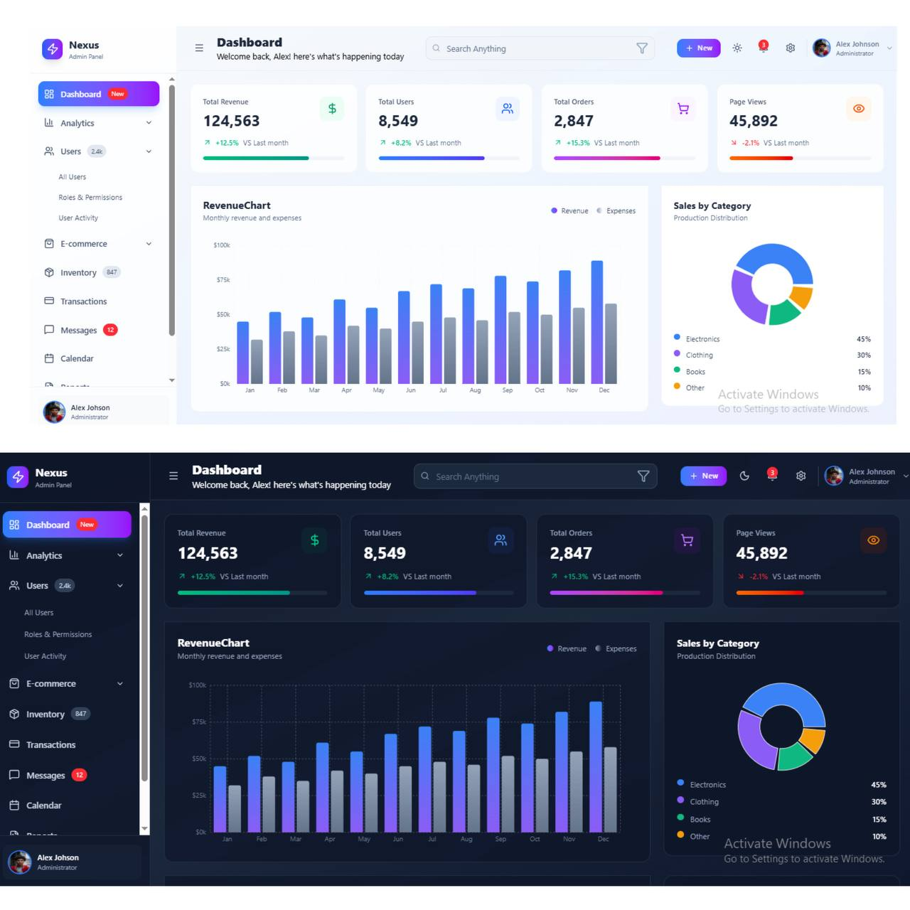
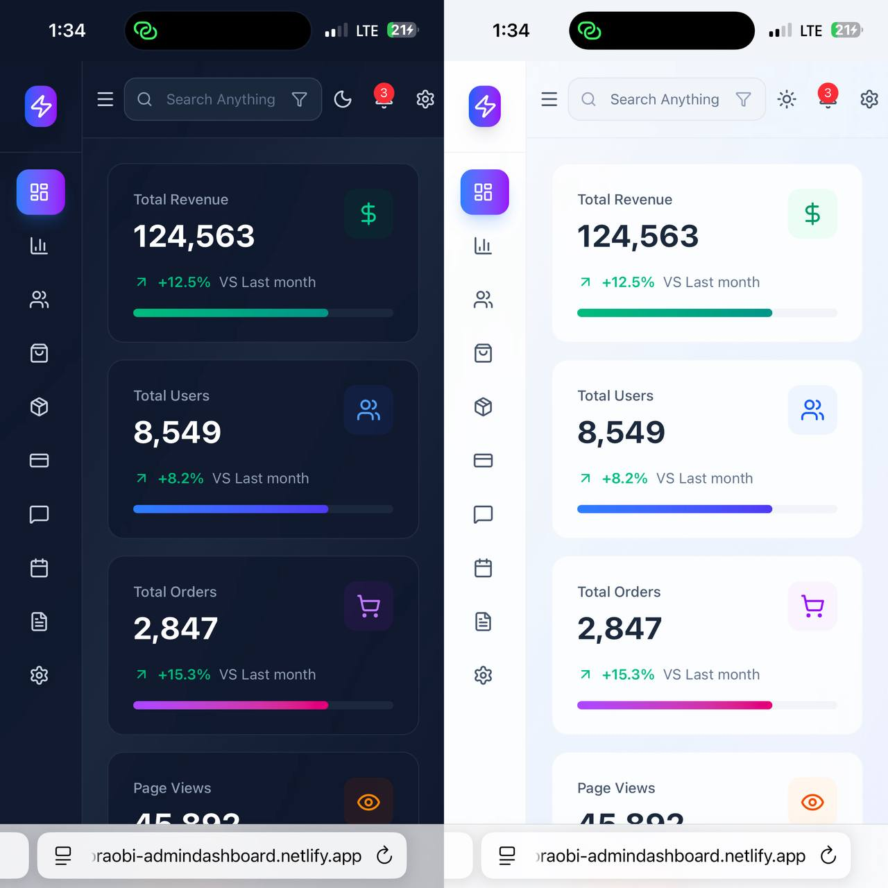

# 🛠️ **Admin Dashboard – React + Vite**

A modern **React + Vite** powered **Admin Dashboard frontend** built for analytics, management, and monitoring.  
This project is **pure frontend**, with **no API**, **no backend**, and **no context file**.  
All data shown is either static, mock, or local component state.

---

## 🖼️ **Screenshots**

  

## 🧰 **Tech Stack**

This project uses the following tools and libraries:

### ⚛️ **Core Framework**

- **React (https://react.dev/)** – UI library for building interactive dashboards
- **Vite (https://vitejs.dev/)** – Ultra-fast build tool and dev server

### 🎨 **Styling**

- **Tailwind CSS (https://tailwindcss.com/)** – Utility-first CSS framework
- **@tailwindcss/vite** – Tailwind plugin for Vite integration

### 📊 **Charts & Icons**

- **Recharts (https://recharts.org/)** – Charting library for analytics and visualizations
- **Lucide (https://lucide.dev/)** – Icon library
- **Lucide-React (https://lucide.dev/)** – React components for Lucide icons

### ⚙️ **React Utilities**

- **react-is** – Helps check element types (internal React utility)

### 🛠️ **Development Tools**

- **ESLint (https://eslint.org/)** – Code linting
- **eslint-plugin-react-hooks** – Ensures correct hook usage
- **eslint-plugin-react-refresh** – Enables fast refresh during dev
- **@vitejs/plugin-react** – React plugin for Vite
- **globals** – Common global variables for linting
- **@types/react**, **@types/react-dom** – Type definitions for React

---

## 🚀 **Features**

- 📊 **Analytics Dashboard** – Charts, graphs, stats using Recharts
- 🧭 **Modern UI** – Clean layout built with TailwindCSS
- 🌙 **Dark Mode Support** – Switch between light and dark themes
- ⚡ **Fast Development** – Powered by Vite's lightning-fast HMR
- 📱 **Responsive Design** – Mobile-friendly admin layout
- 🎨 **Icon-rich Interface** – Lucide icons for buttons and navigation
- ⚙️ **No Backend Required** – Fully static frontend dashboard
- 🔧 **Maintainable Codebase** – ESLint ensures clean consistent code

---

## 📦 **Dependencies / Libraries Used**

- **react**
- **react-dom**
- **tailwindcss**
- **@tailwindcss/vite**
- **lucide**
- **lucide-react**
- **recharts**
- **react-is**

---

## 📝 **Project Notes**

- No API is used
- No backend
- No global context/state file
- Entire dashboard is component-driven
- Data can be replaced with real APIs in the future
